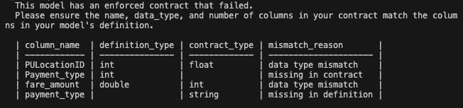
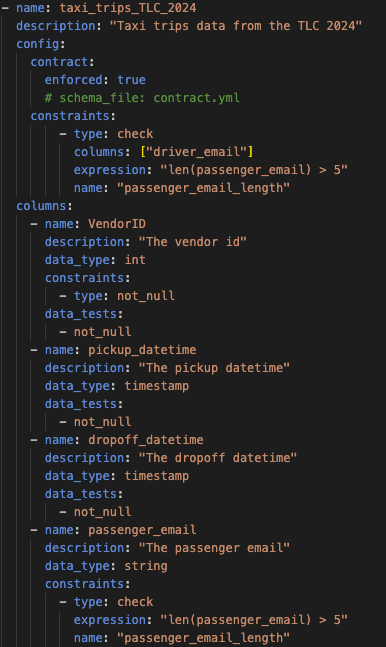
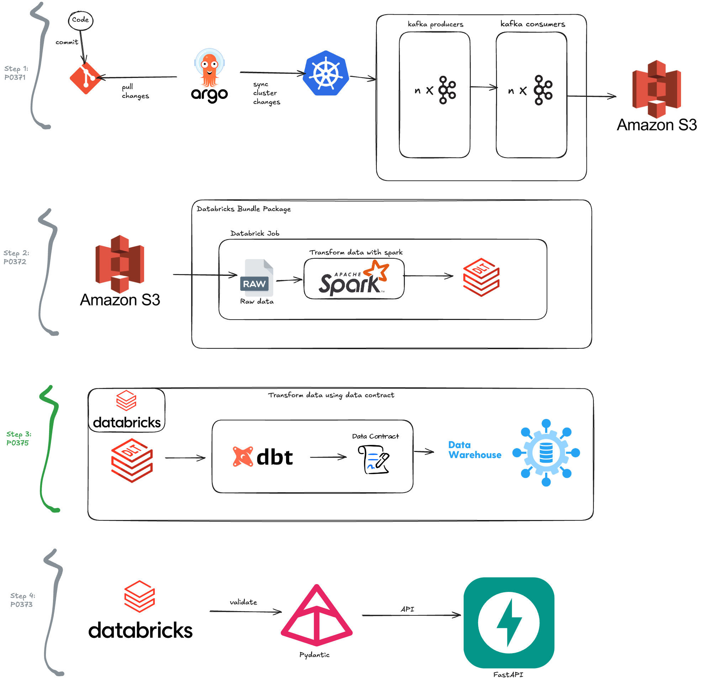

# Project Summary

This project is a dbt (data build tool) initiative designed to run on Databricks, utilizing GitHub Actions for CI/CD. The primary objective is to transform data based on predefined data contracts into new target tables, ensuring data integrity and consistency throughout the process.

## Project Structure

## execution example result

## Project architecture
